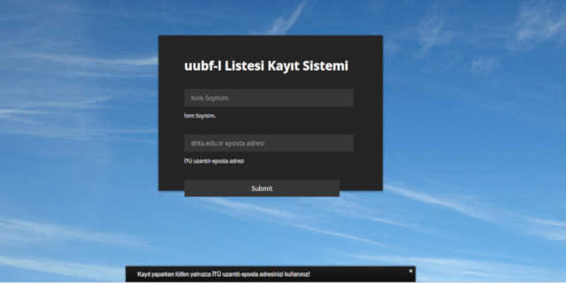

# MARS
Mailman Registration System - Collect email addresses to add mailman list manager



## Install:

```
$ git clone https://github.com/celikbas/MARS.git
$ cd MARS
$ composer install
# create sql tables from list_subs.sql file
$ mv config_sample.php config.php && vim config.php 
```

## Todo:

- [x] Screenshout added
- [ ] Multilanguage support
- [ ] Subscribe to more than one list
- [ ] Auto copy-paste probably using borderless textarea 


